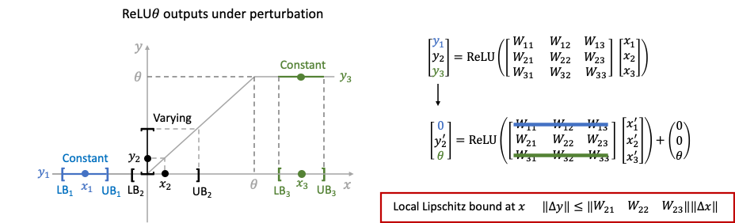

# Training Certifiably Robust Neural Networks with Efficient Local Lipschitz Bounds (Local-Lip)



## Introduction

TL;DR: We propose an efficient and trainable local Lipscthiz bound for training certifibly robust neural networks.

Certified robustness is a desirable property for deep neural networks in safety-critical applications, and popular training algorithms can certify robustness of a neural network by computing a global bound on its Lipschitz constant. However, such a bound is often loose: it tends to over-regularize the neural network and degrade its natural accuracy. A tighter Lipschitz bound may provide a better tradeoff between natural and certified accuracy, but is generally hard to compute exactly due to non-convexity of the network. In this work, we propose an efficient and trainable \emph{local} Lipschitz upper bound by considering the interactions between activation functions (e.g. ReLU) and weight matrices. Specifically, when computing the induced norm of a weight matrix, we eliminate the corresponding rows and columns where the activation function is guaranteed to be a constant in the neighborhood of each given data point, which provides a provably tighter bound than the global Lipschitz constant of the neural network. Our method consistently outperforms state-of-the-art methods in both clean and certified accuracy on MNIST, CIFAR-10 and TinyImageNet datasets with various network architectures.

For more details please see our [NeurIPS 2021 paper](url).

## Contents

This directory includes the Pytorch implementation of Local-Lip, an efficient and trainable local Lipscthiz bound for training certifibly robust neural networks.
`Local_bound.py` contains the the codes for computing the proposed local Lipschitz bound, and the codes for certifiable training and evaluation.
`train_cifar10.py` and `train_mnist.py` contain the codes to train models on CIFAR-10 and MNIST. 
`evaluate.py` contains the codes to evaluate certified robustness.
`utils.py` contains the codes of architectures and hyper-parameter specifications. 
`data_load.py` contains the codes of loading in the data.
The pretrained models are in `pretrained`.

The codes for training models on TinyImagenet are in the `TinyImagenet` folder. We use distributed training to train on 4 GPUs for the TinyImagenet dataset. The codes are organized in the same way as the codes for CIFAR-10 and MNIST, but modified to accomodate for distributed training.

## Requirements
The codes are tested under NVIDIA container image for PyTorch, [release 20.11](https://docs.nvidia.com/deeplearning/frameworks/pytorch-release-notes/rel_20-11.html#rel_20-11).

*   torch==3.6
*   torch==1.8.0
*   torchvision==0.8.0
*   advertorch==0.2.3
*   Apex (only needed for distributed training)

## Usage

All the training scripts are in `run_job.sh`

For instance, to train a certifiably robust CIFAR-10 model using local Lipschitz bound, run: `python train_cifar10.py --model c6f2_relux --sniter 2 --init 2.0 --end_lr 1e-6`.

To run experiments on TinyImagenet, go to the `TinyImagenet` folder.
To prepare the TinyImagenet dataset, use `TinyImagenet/tinyimagenet.sh`, and copy the dataset to folder `/workspace/tiny-imagenet-200/`.


## Citation

If you find this useful for your work, please consider citing

```
@article{huang2021local,
  title={Training Certifiably Robust Neural Networks with Efficient Local Lipschitz Bounds},
  author={Huang, Yujia and Zhang, Huan and Shi, Yuanyuan and Kolter, J Zico and Anandkumar, Anima},
  journal={NeurIPS},
  year={2021}

}
```